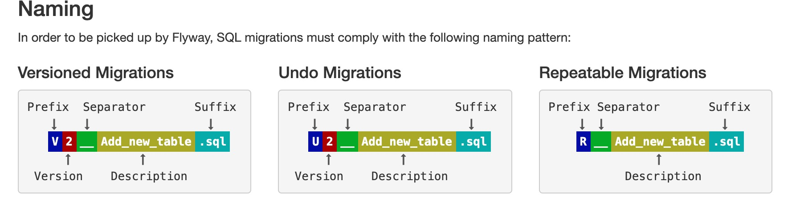

# flyway-demo
主要用于记录flyway + springboot整合使用

针对springboot的版本和flyway的版本建议如下：
```
springboot2.0.x  推荐使用flyway5.2.4的版本（如果强制采用6.0版本及以上会出现文件无法找到的错误）
springboot2.1.x ~ 最新版本 推荐使用flyway6.2.4的版本
```
----
### 这是一个使用flyway的小demo,让大家快速的熟悉起来对flyway的使用

flyway的具体相关配置请查看application.yml文件中的注释

我们查看flyway官方文档关于数据迁移文件的命名规则：


这里统一定义数据迁移文件名称格式为：
```
Prefix + Version + Separator + Description + Suffix
来标识一个数据迁移文件。
比如: V1.0.1__Add_new_table.sql 这个例子：
前缀（Prefix） => V 

版本号（Version）=> 1.0.1

分隔符（Separator）=> __ （默认采用双下划线）

文件描述（Description）=> Add_new_table

后缀（Suffix）=> .sql
```

 flyway追踪迁移文件的生命周期是通过版本号来鉴定的，
 版本号采用最左前缀原则进行匹对
 
 `比如：1.10.1 > 1.0.3 > 1.0.2 > 1.0.1 这种形式。`
 
 服务的每次启动都会记录该次的最新的版本号，下次启动时会自动配对版本号是否有所更新
 ，更新则执行最新的数据迁移文件。

----

如果使用的是druid的数据源，我们需要将其的一些wallConfig进行关闭或者开启

这里只演示针对mybatis的动态数据源的配置，其中druid作为动态数据源中的其中一个，
我们需要开启一下配置才能联合flyway一起使用
具体解决方案在druid的gihub issue中有所提及，链接如下：
https://github.com/alibaba/druid/issues/1594
```
# 不进行检测是否使用了“禁用的变量”
spring.datasource.dynamic.druid.wall.variant-check = false
# 允许非以上基本语句的其他语句，通过此可以开启DDL
spring.datasource.dynamic.druid.wall.none-base-statement-allow = true
# 允许sql语句中添加注释，以能够对flyway的初始化sql放行
spring.datasource.dynamic.druid.wall.comment-allow = true
# 允许一次执行多条语句，缺省关闭
spring.datasource.dynamic.druid.wall.multi-statement-allow = true
```

线上部署的时候，发现flyway版本大于5.2.1的时候，会出现SELECT command denied to user 'xxx'@'xxx.xx.xx.xxx' for table 'user_variables_by_thread'异常，其缘由就是访问user_variables_by_thread没有；
解决方案1. 给mysql用户赋予读写权限。
解决方案2. 降低flyway的版本为5.2.1及以下。
具体解决方案请查看url:https://wemp.app/posts/0c0c61fe-c317-44da-87ec-19253c251a8c

